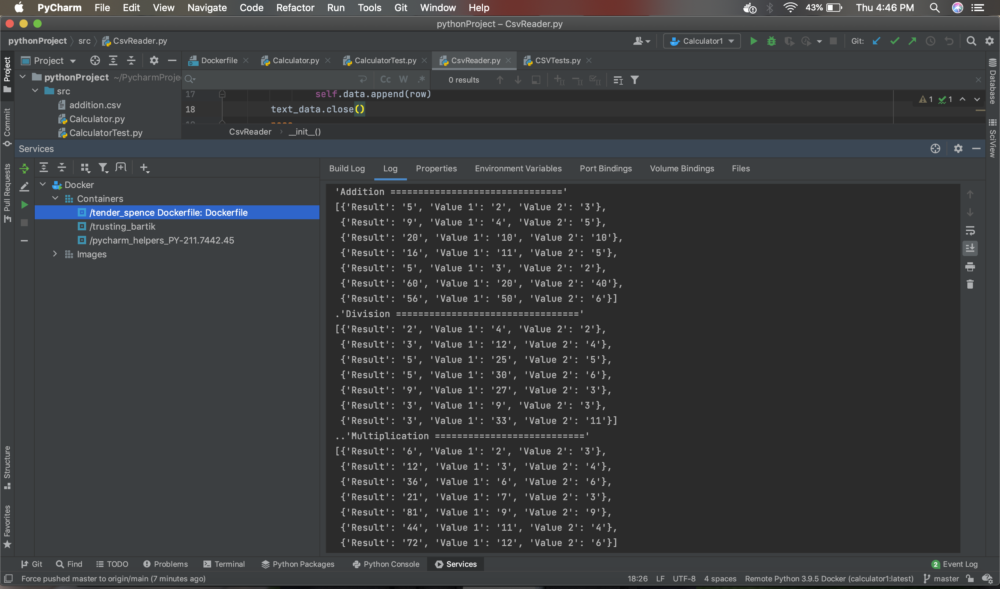
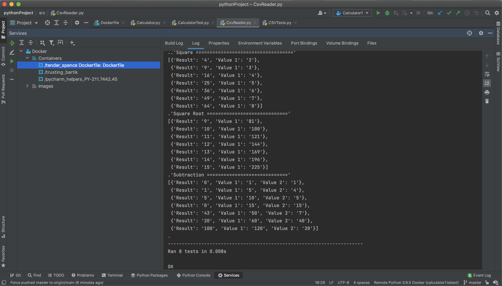

# Calculator

## Description: ##
Created a Calculator that performs operations on addition, subtraction, multiplication, division, square and square root values 
using Python with automated unit tests.

## Screenshots of Successful Testing: ##
 

 

